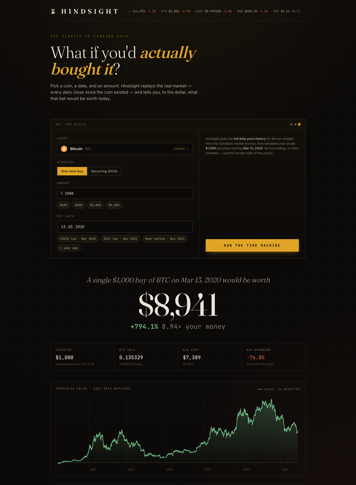
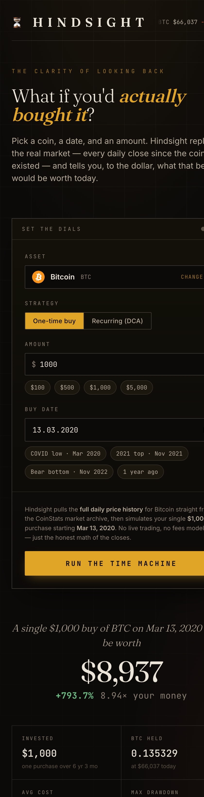
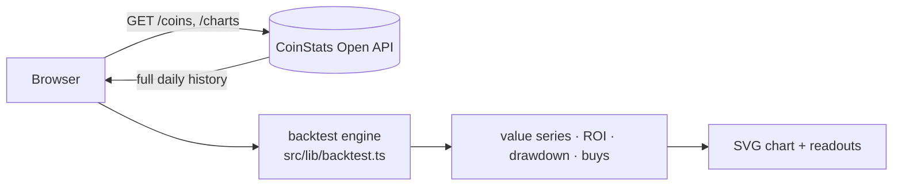

<div align="center">

# ⏳ HINDSIGHT

### _The clarity of looking back._

A what-if time machine for crypto. Pick a coin, a date, and an amount — Hindsight replays the **real market**, every daily close since the coin existed, and tells you to the dollar what that bet would be worth today.

<br />

[](https://hindsight-crypto.web.app)

[](LICENSE)


<br />



</div>

---

## Overview

Most crypto tools tell you what something costs *now*. Hindsight answers the question people
actually ask themselves: **"What if I'd bought it back then?"**

You set the dials — an asset, a strategy, an amount, a date — and the app pulls that coin's full
daily price history and replays it locally to compute the honest outcome: total value today, ROI,
the path it took to get there, and the bumps along the way.

It's a **pure frontend** (no server). The browser talks to the [CoinStats Open API](https://openapi.coinstats.app/)
directly, and the entire simulation runs client-side.

## ✨ Features

- **Two strategies, one engine**
  - 🎯 **One-time buy** — _"A single $1,000 of BTC on Mar 13 2020 would be worth $8,941 today — 8.94×."_
  - 🔁 **Recurring (DCA)** — _"$50 into BTC every week since…"_ — complete with a **vs. lump-sum**
    verdict so you see whether dollar-cost-averaging actually won.
- **📈 Interactive value chart** — hand-built SVG: a cost-basis line, a dot for every purchase, and a
  hover scrubber that reads out value and amount-invested on any day.
- **🔍 Search the whole market** — debounced autocomplete over ~20,000 coins.
- **🧮 Real numbers** — invested, units held, average cost, max drawdown, peak value, best/worst
  single days, and the lump-sum alternative.
- **🕰️ One-tap historical moments** — jump to the COVID low, the 2021 top, the bear-market bottom,
  or one year ago.
- **🪙 Live ticker** — top coins streaming across the masthead.
- **🎨 A look that isn't a template** — warm filmic palette, [Fraunces](https://fonts.google.com/specimen/Fraunces)
  serif display against monospaced tabular numerals, an engraved grid, and a single brass accent.

## 📸 Screenshots

<div align="center">
<table>
  <tr>
    <td align="center"><strong>Desktop</strong></td>
    <td align="center"><strong>Mobile</strong></td>
  </tr>
  <tr>
    <td valign="top"></td>
    <td valign="top"></td>
  </tr>
</table>
</div>

## 🛠️ How it works



The simulation in [`src/lib/backtest.ts`](src/lib/backtest.ts):

1. **Schedule the buys** — one purchase, or one every day / week / month from the start date.
2. **Price each buy** — binary-search the daily history for the close on that date and accumulate
   coin units.
3. **Replay the timeline** — walk forward to build the value-over-time series, track the running
   cost basis, compute peak value and max drawdown, and calculate a **lump-sum baseline** (the same
   total invested all at once on day one) for comparison.

No live trading and no fees are modeled — just the arithmetic of real daily closes. Long-range
history is daily resolution, which faithfully models HODL / DCA strategies (not intraday fills).

## 🧱 Tech stack

| Layer        | Choice                                                            |
| ------------ | ----------------------------------------------------------------- |
| UI           | React 18 + TypeScript                                             |
| Build        | Vite 5                                                            |
| Charts       | Hand-rolled SVG (no chart library)                                |
| Data         | [CoinStats Open API](https://openapi.coinstats.app/) (CORS, direct from browser) |
| Hosting      | Firebase Hosting (static)                                         |
| Type-styling | Fraunces · Inter · JetBrains Mono                                 |

## 🚀 Getting started

```bash
# 1. install
npm install

# 2. add your CoinStats key
cp .env.example .env
#    edit .env → VITE_COINSTATS_API_KEY=...   (grab a key at https://openapi.coinstats.app/)

# 3. run
npm run dev        # → http://localhost:5173
```

### Scripts

| Command           | What it does                              |
| ----------------- | ----------------------------------------- |
| `npm run dev`     | Start the Vite dev server                 |
| `npm run build`   | Build the static site into `dist/`        |
| `npm run preview` | Serve the production build locally        |

## ☁️ Deployment

Deployed to Firebase Hosting as the site `hindsight-crypto`:

```bash
npm run build
firebase deploy --only hosting:hindsight-crypto
```

> `firebase.json` and `.firebaserc` are git-ignored in this repo. To deploy from a fresh clone,
> run `firebase init hosting` (public dir `dist`, single-page rewrite to `/index.html`) or recreate
> those two files.

## 🗂️ Project structure

```
src/
  api.ts                  CoinStats Open API client (called directly from the browser)
  lib/
    backtest.ts           the simulation engine (one-time + recurring DCA)
    format.ts             USD / %, date and span formatting
  hooks/
    useCountUp.ts         eased number animation for the payoff readout
  components/
    CoinSearch.tsx        debounced autocomplete over the coin universe
    ValueChart.tsx        SVG value chart with buy markers + hover scrubber
    TickerStrip.tsx       live top-coins ticker
  App.tsx                 the console + result composition
  styles.css              the design system
docs/                     screenshots used in this README
```

## 🧭 Roadmap

- [ ] Shareable result cards (downloadable PNG / copy-link)
- [ ] Per-coin date clamping to each coin's listing date
- [ ] Compare two coins / strategies side by side
- [ ] Inflation-adjusted ("real") returns
- [ ] Optional proxy to hide the API key (Cloud Function / Cloud Run)

## ⚠️ A note on the API key

Because this is a pure-frontend app, the CoinStats API key is **bundled into the shipped JavaScript
and is publicly visible** — an inherent trade-off of having no backend. Use a key you're willing to
expose and can rate-limit / rotate from the CoinStats dashboard. To hide it, put a small proxy in
front of the API and point [`src/api.ts`](src/api.ts) at it instead.

## 📄 License

[MIT](LICENSE) © 2026 Rafael Muradyan

---

<div align="center">

_Past performance is not a promise — it's a lesson._
<br />
Market data by the <a href="https://openapi.coinstats.app/">CoinStats Open API</a>.

</div>
